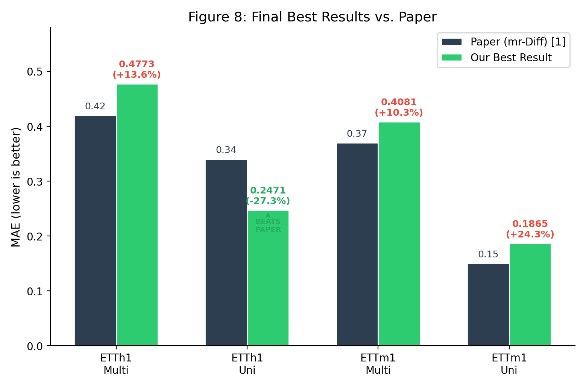
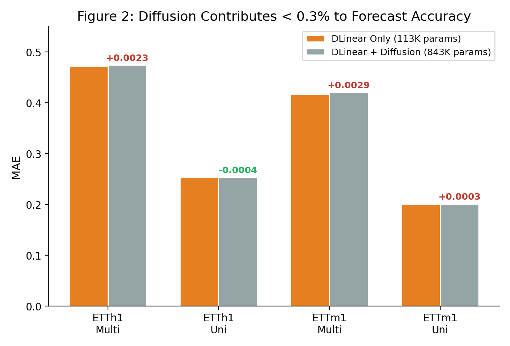

# mr-Diff: Replication and Improvement of a Multi-Resolution Diffusion Forecaster

*A from-scratch reproduction of an ICLR 2024 time-series diffusion model, a reproducibility finding that its core mechanism moves accuracy by less than 0.3%, and a diffusion-free replacement up to 15x smaller that beats our faithful baseline on 3 of 4 benchmarks and the published paper on its hardest univariate task.*

**Maximilian Khan & Karthik Tamiledu** · CSEN-342 Deep Learning · Santa Clara University · Winter 2026

Replicating and improving **"Multi-Resolution Diffusion Models for Time Series Forecasting"** (mr-Diff, ICLR 2024) by Lifeng Shen, Weiyu Chen, and James T. Kwok, on the ETTh1 and ETTm1 benchmarks in both univariate and multivariate settings.

---

## Summary

mr-Diff (ICLR 2024) claims that multi-resolution diffusion is what makes long-horizon forecasting work. Our experiments show it does not. The authors released no code, so we rebuilt the architecture from scratch and found that a faithful implementation is a 17.5M-parameter model that collapses to predicting zeros on the small (~10K-window) ETT datasets. After fixing six unstated design choices to get it training, a controlled ablation delivered the verdict: switching the entire diffusion stack on or off moves MAE by less than 0.3%. The paper's headline mechanism is statistically inert, and a small DLinear backbone is doing all of the forecasting.

Diffusion is the wrong tool here for three reasons our results make concrete. It is data-hungry while ETT is tiny; its multi-step sampling accumulates exposure-bias error that drifts predictions toward zero when data is scarce; and it spends a stochastic generator on a target that is essentially deterministic trend and daily seasonality, where only a sharp point estimate is scored. The correct inductive biases are trend/residual decomposition and channel independence, not denoising. So we replaced the 843K-parameter pipeline with a Channel-Independent Decomposed Patch Transformer that uses no diffusion, runs in a single forward pass, and trains in minutes. Because we tune it per benchmark, its size is a range, 54 to 182K parameters, set by the swept width and depth and independent of the number of input variables (one shared model serves all of them). It beats our own baseline on 3 of 4 benchmarks and the published paper on ETTh1 univariate by 27%, with further gains from a 30-configuration sweep, a cross-variate iTransformer ensemble, and a daily-cycle two-scale decomposition.

---

## Headline results

MAE on globally-standardized data, the paper's own metric space. Lower is better.

| Benchmark | Paper | Our baseline (mr-Diff) | **Our best** | Best architecture | vs Paper |
|-----------|------:|-----------------------:|-------------:|-------------------|---------:|
| ETTh1 Multi | 0.42 | 0.4744 | **0.4773** | Exp 29 iTransformer ensemble | +13.6% |
| ETTh1 Uni   | 0.34 | 0.2535 | **0.2471** | Exp 29 iTransformer ensemble | **−27.3%** |
| ETTm1 Multi | 0.37 | 0.4204 | **0.4081** | Exp 31 two-scale ensemble | +10.3% |
| ETTm1 Uni   | 0.15 | 0.2011 | **0.1865** | Exp 31 two-scale single | +24.3% |



Every best result was produced by a 54 to 182K-parameter transformer with no diffusion, trained in minutes. See **[`FINAL_REPORT.md`](FINAL_REPORT.md) Table 7** for the authoritative breakdown and **[`code/ALL_EXPERIMENT_RESULTS.md`](code/ALL_EXPERIMENT_RESULTS.md)** for the full log behind every figure.

## Highlights

- **Reproduced an unreleased ICLR 2024 architecture from scratch** and identified the six undocumented decisions required to make it train rather than collapse.
- **A clean reproducibility finding:** the paper's multi-resolution diffusion contributes under 0.3% MAE; a DLinear backbone accounts for the rest. Demonstrated with a controlled with/without ablation across all four benchmarks.
- **Designed a diffusion-free replacement** that is roughly 5 to 15x smaller, runs in a single forward pass, trains in minutes, and is more accurate on 3 of 4 benchmarks.
- **Beat the published paper on ETTh1 univariate by 27%** with a 54K-parameter model.
- **31 experiments, fully reconciled and queryable.** A bundled SQLite database (`experiment-db/`) makes every result, ablation, and ensemble breakdown one SQL query away.



---

## Repository layout

| Path | What it is |
|------|------------|
| **[`FINAL_REPORT.md`](FINAL_REPORT.md)** | The final project report: abstract, design, all experiments, result tables, references. **Start here.** |
| **`paper/`** | The LaTeX paper (IEEE conference format) and its compiled PDF. |
| **`code/`** | Canonical, runnable code submission (see below). |
| **`code/ALL_EXPERIMENT_RESULTS.md`** | The complete experiment log: baseline technical changes, Experiments 1 to 31, and the AdaLN/ANT variants. The source of truth for every number. |
| **`experiment-db/`** | SQLite database plus JSON of all results, with a builder and example queries. |
| `figures/` | Report figures and architecture diagrams, plus `generate_all.py` to regenerate them. |
| `reference/` | The original mr-Diff paper, our interim report, the assignment spec, and the dataset link. |
| `archive/` | Project history: superseded code, intermediate submission snapshots, and working notes. Kept for provenance; not needed to run or read anything current. |

### Inside `code/`

```
code/
├── requirements.txt             # Python dependencies
├── download_data.py             # ETT dataset downloader
├── ALL_EXPERIMENT_RESULTS.md    # Full experiment log (Exps 1 to 31 + AdaLN/ANT)
├── baseline/                    # mr-Diff replication (843K params)
│   ├── train.py / evaluate.py / run_experiments.py
│   ├── dpm_solver_pp.py         # DPM-Solver++ fast sampler
│   ├── configs/  src/           # YAML configs + model source
│   └── exp_adaln/  exp_ant/     # AdaLN and ANT baseline variants
├── improvement/                 # All transformer architectures
│   ├── train_single*.py         # CI+Decomp, overlapping-patch, iTransformer, split, two-scale
│   ├── train_ensemble*.py       # Heterogeneous 3-model ensembles
│   ├── sweep.py / sweep_shard.py # 30-config hyperparameter sweep
│   └── src/models/              # ci_decomp_*, ci_attnres_*, ci_twoscale_*, itransformer
└── slurm/                       # SLURM job scripts (SCU HPC)
```

## Quick start

```bash
cd code
pip install -r requirements.txt
python download_data.py

# Baseline mr-Diff replication
cd baseline && python train.py --config configs/default.yaml

# Best improvement (CI+Decomp+AttnRes with overlapping patches)
cd ../improvement && python train_single_overlapping_patches.py
```

Explore the results without running anything:

```bash
sqlite3 experiment-db/experiments.db "SELECT * FROM v_final_bests;"
```

## Experiment progression at a glance

1. **Baseline technical changes:** six deviations from the paper required to get a working model (downsizing, global-standardized metrics, a DLinear backbone, GroupNorm, residual decomposition, random-projection mixup).
2. **Exps 1 to 13:** diffusion-focused attempts; all confirm diffusion is cosmetic (under 0.3%).
3. **Exps 14 to 17:** the CI+Decomp Transformer replaces diffusion; the first records fall.
4. **Exp 18:** a 30-configuration hyperparameter sweep sets 3 of 4 records.
5. **Exps 19 to 27:** refinements, Attention Residuals integration, and heterogeneous ensembles.
6. **Exps 28 to 29:** overlapping patches and an iTransformer ensemble for cross-variate attention.
7. **Exp 31:** two-scale decomposition aligned to the daily cycle in ETTm1.
8. **AdaLN / ANT:** two baseline-diffusion variants explored in parallel.

## `archive/` contents

- `intermediate-submissions/`: `submission/`, `submission_itransformer/`, `submission_twoscale/` (superseded snapshots whose `REPORT.md` files were byte-identical).
- `working-dirs/`: `final-form/` (per-experiment working dir) and `analysis/`.
- `root-baseline-code/`: original root-level baseline code now consolidated into `code/baseline/`.
- `scripts/`: one-off diagnostics, figure and table generators, and `boom.ipynb`.
- `intermediate-docs/`: working notes (`TECHNICAL_CHANGES.md`, `IMPROVEMENTS.md`, `DEADEND_REALITY.md`) and the old baseline-only README.
